## Members

Apipark Withedvorrakit 6110546429

Sidtipat Kietchai 6110546046

Natthaphon Rakprakobkij 6110546402

Kasidit Wongpaiboon 6110545422

Jirawadee Sampusri 6110545457

# The overview of Weather-memo

This application is about the weather forecast and pm2.5 that can tell you what today's weather looks like and you should go out or not, and lastly what's the current air quality is. The data source contains the weather forecast, temperature, current air quality, current weather.

# How to run our project
1. Clone the repository.

```
  $ git clone https://github.com/patdpat/weather-memo.git
```

2. Create virtualenv in the directory and activate virtualenv.
if you do not have virtualenv, install it with this command

```
  $ python3 -m pip install --user virtualenv
```
then 

```
  $ virtualenv venv
```

3. Activate the venv

    On MacOS and Linux:

    ```
      $ source venv/bin/activate
    ```

    On Windows:

    ```
      $ venv\Scripts\activate
    ```

5. Install all required packages and then run database migrations.

```
  pip3 install -r requirements.txt
  python3 manage.py makemigrations
  python3 manage.py migrate
```

6. Run the server.

```
  python3 manage.py runserver
```
api from application database is provided on `localhost:8000/myapi`

#### Don't forget to exit the virtualenv after you finish testing.
```
  deactivate
```


# Instructions to deploy application using Jenkins

# The overview of Weather-memo


This application is about the weather forecast and pm2.5 that can tell you what today's weather is and what the current air quality is. The data source contains the weather forecast, temperature, current air quality, current weather.

# How to run our project
1. Clone the repository.

  $ git clone https://github.com/patdpat/weather-memo.git

2. Create virtualenv in the directory and activate virtualenv.

  $ virtualenv venv
##### On MacOS and Linux:

  $ source venv/bin/activate

##### On Windows:

  $ venv\Scripts\activate

5. Install all required packages and then run database migrations.

  (venv) pip3 install -r requirements.txt
  (venv) python3 manage.py makemigrations
  
6. Run the server.


  (venv) python3 manage.py runserver
#### Don't forget to exit the virtualenv after you finish testing.
```
  (venv) deactivate

## Step 1: Install Jenkins and extra packages

check out the contents of initial-setup.sh .

```
$ vi initial-setup.sh
```

and Copy the contents of the [file](https://github.com/vahiwe/Django-CI-CD-Pipeline/blob/master/initial-setup.sh) to the server.

Save and close the file. Run the script to install the packages.

```
$ chmod +x initial-setup.sh

$ ./initial-setup.sh
```

Once the script is done, visit your servers public IP on port 8080 to view the Jenkins dashboard (http://<YOUR SERVER’S IP>:8080). You’ll see a screen like the one below.

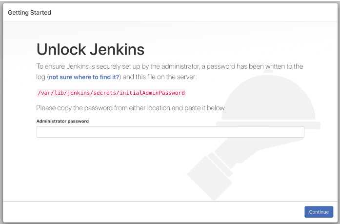

To get your administrator password, run this command to get it.

```
$ sudo cat /var/lib/jenkins/secrets/initialAdminPassword
```

This will output your administrator password. The username associated with this password is admin incase you want to log in with this user. Once you input your administrator password you get a page asking for installation of plugins.

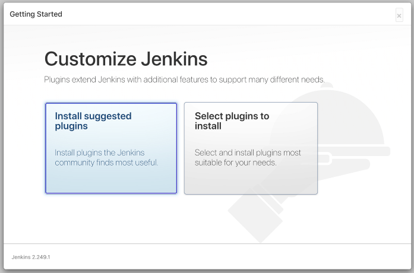

Select Install suggested plugins to install some standard plugins that will help during your pipeline setup. Once the installation is done you are asked to create a normal user.

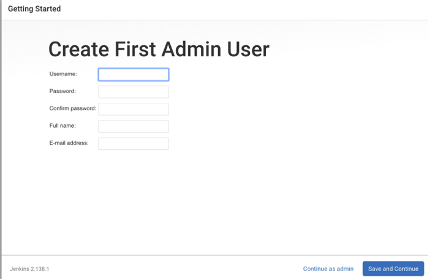

After creating the user, you are asked to set your Jenkins URL. Leave it as default and now you should be logged in.


## Step 2: Disable SELinux and extra Jenkins configuration

Run this command to check the status of SELinux:

```
$ sestatus
```

If it is enabled and set to enforcing mode, then we’ll change it to permissive mode. Nginx might not get access to your socket file if these instructions are not carried out. Open the SELinux configuration file:

```
$ sudo vi /etc/selinux/config
```

Change enforced to permissive

```
// Remove
SELINUX=enforcing

// Replace with
SELINUX=permissive
```

Save and close the file.

You have to switch the user running the jobs from Jenkins to a user with sudo privilege. I’ll be switching to centos user. Open up the this script (using VI or other editor):

```
$ sudo vi /etc/sysconfig/jenkins
```

Find this line and change to “centos” or any user you prefer:

```
$ JENKINS_USER="centos"
```

Then change the ownership of Jenkins home, webroot and logs:

```
$ sudo chown -R centos:centos /var/lib/jenkins

$ sudo chown -R centos:centos /var/cache/jenkins

$ sudo chown -R centos:centos /var/log/jenkins
```

Restart Jenkins and check the user has been changed:

```
$ sudo /etc/init.d/jenkins restart

$ ps -ef | grep jenkins
```

Now you should be able to run the Jenkins jobs as the centos user. Now you can reboot the server:

```
$ sudo shutdown now -r
```

Reconnect back to your instance and check the status of SELinux:

```
$ sestatus
```

If it has changed to permissive then you’re good to go.

## Step 3: Setup Jenkins Pipeline

Log in to the Jenkins dashboard.

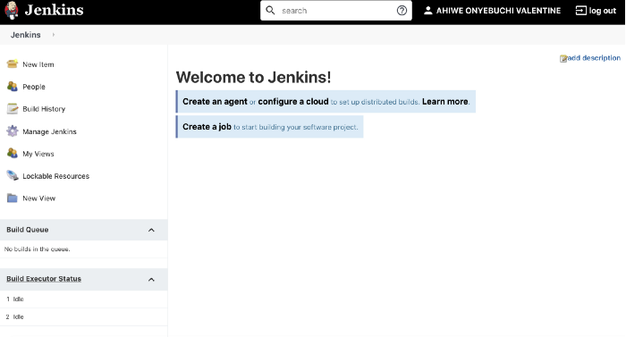

On the left sidebar click on Manage Jenkins. This opens the Management dashboard of Jenkins. Click on ‘Configure Global Security’. Scroll down and enable ‘Enable proxy compatibility’ on the ‘CSRF Protection’. Apply and Save.

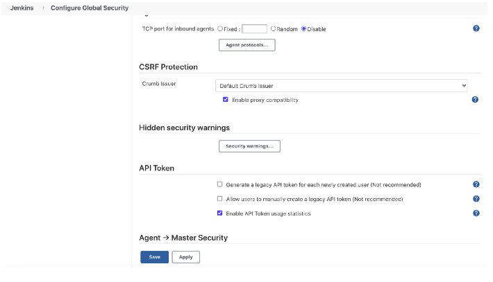

Now we can setup the Jenkins pipeline. Go to Jenkins home and Click on New Item. Enter Name and select Pipeline:

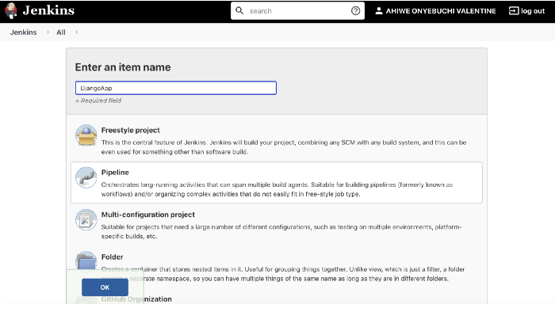

Go on to the next page. Scroll down, switch pipeline definition to `Pipeline Script from SCM`, Select Git as the SCM and Input your repository URL.

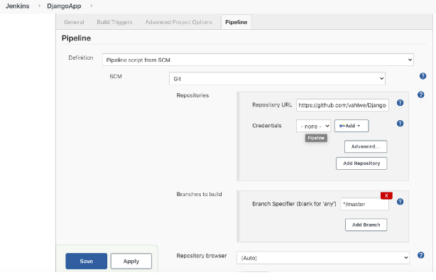

Add a trigger to the pipeline to rerun when there’s a new commit. This is what updates the code changes to your application automatically without you manually running the commands. You can add multiple triggers like running at different times of the day. The triggers makes use of the linux cron job string format.

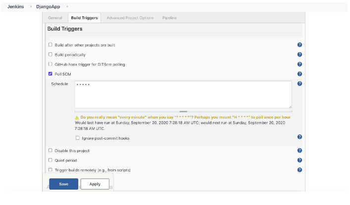

Once all this is done you can Apply and Save. Your Pipeline should start running anytime soon. If you check the README of the project used in this article there are some prerequisite steps that should be carried out to have everything running smoothly.

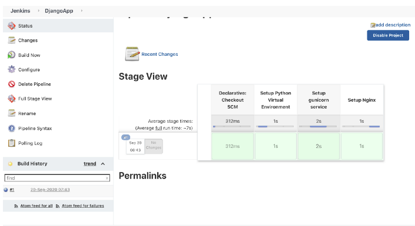

The pipeline ran successfully. Though this doesn’t guarantee that everything is okay. You can check the logs of the stages in the pipeline to verify that everything is working.

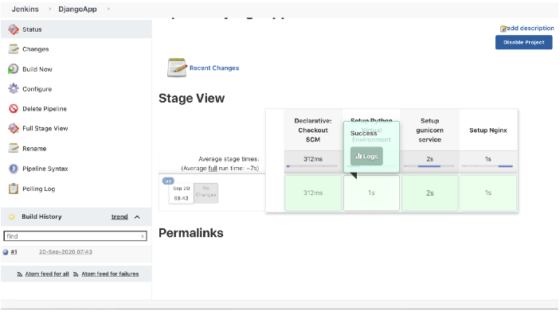

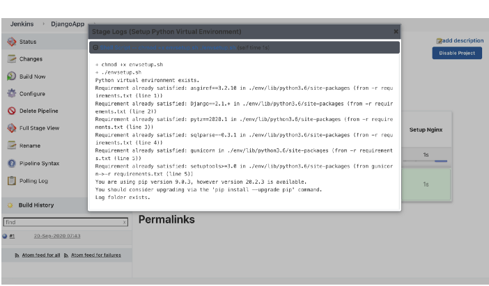

After checking the logs of all stages looks like everything ran fine. Now we can visit the webpage using the IP Address of the server.
